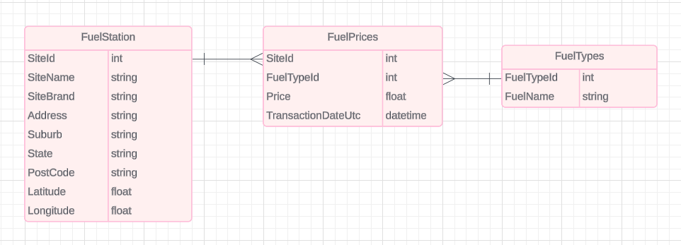

# Queensland Fuel Price Data Analysis Project

## Project Overview

This project is focused on analyzing fuel prices in Queensland, Australia, and examining the relationships between fuel prices, crude oil prices, and Terminal Gate Pricing (TGP). The analysis aims to provide insights into price trends, site and brand distribution, and real-time snapshots of fuel prices, with visualizations including maps and charts.

## Data Sources

1. **Queensland Fuel Price Data (2024)**
   - Source: [Queensland Government Open Data Portal](https://www.data.qld.gov.au/dataset/fuel-price-reporting-2024)
   - This dataset provides real-time and historical fuel price data for various fuel types across Queensland. The data includes details such as site information, fuel type, prices, and geographic location.

2. **Crude Oil Prices**
   - Source: [Investing.com Crude Oil Historical Data](https://www.investing.com/commodities/crude-oil-historical-data)
   - This data provides daily crude oil prices, which are used to analyze the relationship between global oil prices and local fuel prices.

3. **Australian Terminal Gate Pricing (TGP)**
   - Source: [Australian Institute of Petroleum](https://www.aip.com.au/historical-ulp-and-diesel-tgp-data)
   - TGP data includes wholesale fuel prices for unleaded petrol (ULP) and diesel across various Australian cities. This data helps to compare wholesale pricing trends with retail prices at fuel stations.

## Project Workflow

### 1. Data Collection and Preprocessing
   - **Queensland Fuel Data** is retrieved via CSV files and API calls, cleaned to remove invalid values (e.g., price marked as 9999, which indicates no stock), and formatted for analysis.
   - **Crude Oil Prices** are fetched and cleaned to ensure date alignment with fuel price data for time series comparison.
   - **TGP Data** is downloaded and cleaned for integration with fuel prices, helping to track the impact of wholesale fuel costs.

### 2. Preprocessing for Data Analysis
   - Remove price outliers using the interquartile range (IQR) method.
   - Convert transaction timestamps to a common datetime format to facilitate time series analysis.
   - Aggregate daily fuel prices (min, median, max) per fuel type and combine the data with crude oil and TGP data.

### Data Model

In this project, I used pandas DataFrame to manage the data, but for scaling up, we can consider using a database. Based on the fuel price data provided by Queensland, we can convert it into three related tables as illustrated in the following diagram:

- **Fuel Station Table**: Contains details about each fuel station, including the `SiteId` as the primary key, along with attributes like `Site Name`, `Site Brand`, `Address`, and geolocation data.
- **Fuel Prices Table**: Stores the fuel price data for different fuel types at each station. This table has foreign keys referencing `SiteId` from the Fuel Station table and `FuelTypeId` from the Fuel Types table.
- **Fuel Types Table**: A lookup table that stores different fuel types with a `FuelTypeId` as the primary key and the `Fuel Name` as an attribute.

### DataFrame-Based Analysis

For the analysis, I utilized pandas DataFrames to replicate a database-like structure:
- **Primary Key (`SiteId`)**: The `SiteId` column was used as the key to uniquely identify each fuel station. I applied this column to merge and filter data, similar to how primary keys work in relational databases.
- **DataFrames as Tables**: I created separate DataFrames for different analysis purposes:
  - The main DataFrame containing fuel price data was filtered based on fuel types, dates, and site information to mimic the functionality of SQL `JOIN` and `WHERE` clauses.
  - I often copied the DataFrame and worked on subsets (like the price trends of specific fuel types or price comparisons among brands) to analyze data just like you would when querying separate tables in a database.
- **Efficient Analysis**: By using pandas, I could efficiently group data, calculate price ranges, and perform operations like min/max/median aggregations on fuel prices over time. This method allowed for more flexible data exploration while avoiding the overhead of setting up a full-scale database.

Overall, using pandas DataFrames allowed for a simpler and faster workflow for data analysis, while also giving flexibility to handle data in a relational format if scaling up to a database becomes necessary in the future.

### 3. Data Analysis
   - **Price Trend Analysis**: Analyze and visualize price trends for different fuel types over time, alongside crude oil and TGP price trends.
   - **Brand and Site Analysis**: Identify major fuel brands and examine site-level price variations across Queensland.
   - **Geospatial Analysis**: Create interactive maps to visualize fuel prices across the region, showing price distributions per site and allowing comparison by fuel type and brand.
   - **Current Price Snapshot**: Display the most recent prices, with color-coded price levels across Queensland fuel stations.

### 4. Visualizations
   - **Price Trend Charts**: Show historical trends in fuel prices, crude oil prices, and TGP data.
   - **Geospatial Maps**: Interactive maps displaying price ranges and fuel stations, with color coding to indicate price variations.
   - **Current Price Distribution**: Provide a snapshot of current fuel prices across regions, with prices color-coded to highlight high and low price areas.

## How to Run the Project

1. Clone the repository and install required dependencies (`requirements.txt`).
2. Retrieve fuel price data from the Queensland Government API, crude oil prices from Investing.com, and TGP data from AIP.
3. Run the analysis scripts to generate charts and maps, and review the results in your browser.

---

This project demonstrates a robust approach to fuel price analysis, integrating multiple data sources for comprehensive insights.
