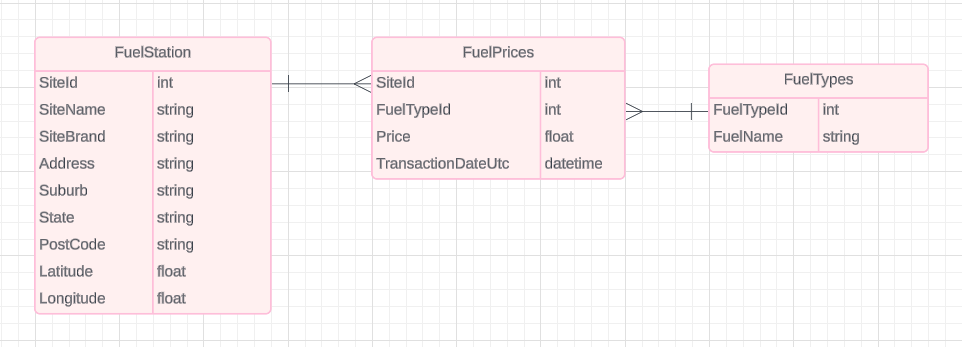
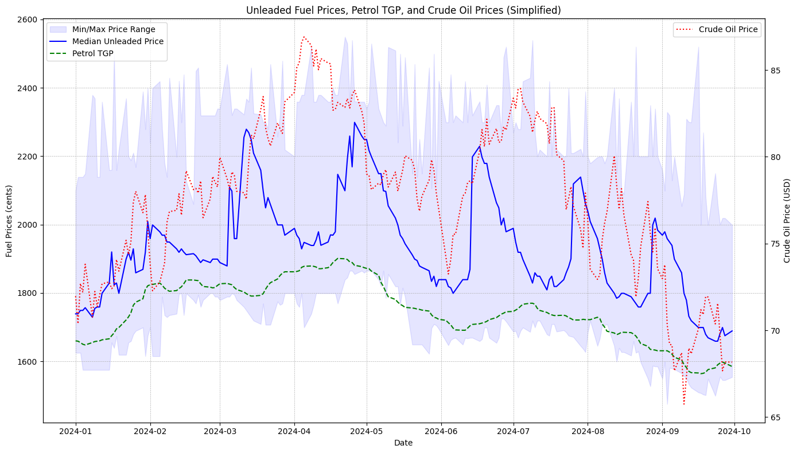
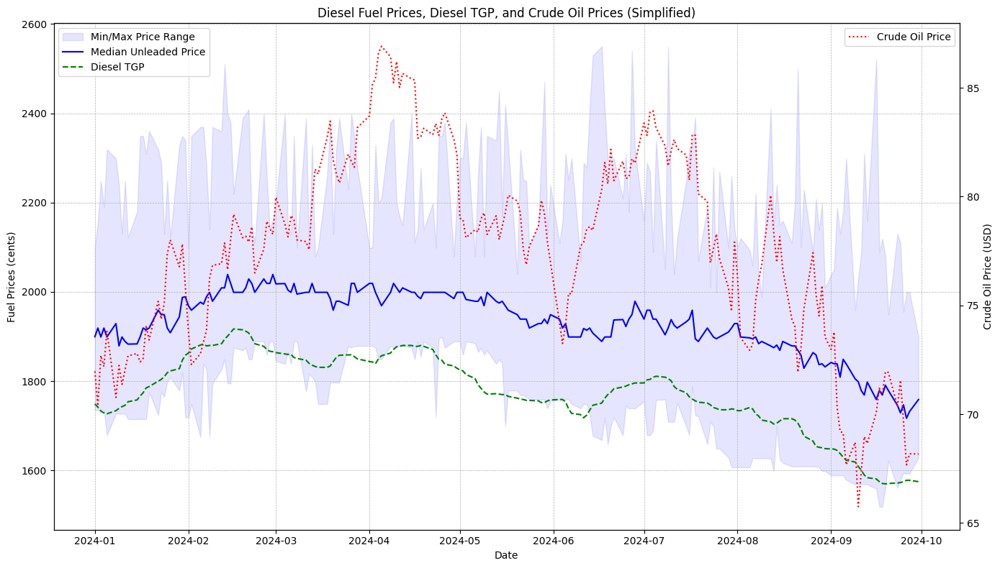

# Queensland Fuel Price Data Analysis Project

## Project Overview

This project focuses on analyzing fuel prices in Queensland, Australia, and examining the relationships between local fuel prices, global crude oil prices, and Terminal Gate Pricing (TGP). While adapting to life in Australia, I became intrigued by how fuel prices are determined. My curiosity sparked this research and project to better understand fuel price movements in the country.

### Personal Experience

As a recent arrival in Australia, fuel prices piqued my interest, especially given their daily fluctuations. I began investigating how prices are set by exploring factors such as global crude oil prices and the wholesale pricing system known as TGP. After studying fuel price trends this year, I conducted detailed analyses and visualizations, revealing various patterns and insights.

The Queensland Government offers real-time fuel price data through an API, so I took advantage of this by developing a simple web app to fetch and display live price information. The analysis and findings from this project have been both educational and engaging, and I hope they provide useful insights to others interested in this topic.

## Data Sources

To make this project work, I performed specific actions with each data source, as detailed below:

1. **Queensland Fuel Price Data (2024)**
   - Source: [Queensland Government Open Data Portal](https://www.data.qld.gov.au/dataset/fuel-price-reporting-2024)
   - I downloaded monthly CSV files from this dataset and saved them as `fuel_prices_OOO_2024.csv`, where "OOO" is a 3-letter abbreviation for each month (e.g., JAN, FEB, etc.). The files contain real-time and historical fuel price data, site information, and geographic locations for stations across Queensland.

2. **Crude Oil Prices**
   - Source: [Investing.com Crude Oil Historical Data](https://www.investing.com/commodities/crude-oil-historical-data)
   - I downloaded daily crude oil price data from this source, and the file was automatically saved as `Crude Oil WTI Futures Historical Data.csv`. This data allows analysis of global oil price trends in relation to local fuel prices.

3. **Australian Terminal Gate Pricing (TGP)**
   - Source: [Australian Institute of Petroleum](https://www.aip.com.au/historical-ulp-and-diesel-tgp-data)
   - I downloaded two CSV files from the AIP website: `Petrol TGP-Table 1.csv` for unleaded petrol prices and `Diesel TGP-Table 1.csv` for diesel prices. These wholesale price datasets help in comparing retail fuel prices with wholesale costs.

## Project Workflow

### 1. Data Collection
   - **Queensland Fuel Data**: Retrieved via CSV files, cleaned (e.g., removed `9999` values indicating no stock), and saved for analysis.
     - File: `fuel_prices_OOO_2024.csv`
   - **Crude Oil Prices**: Downloaded and cleaned to ensure date alignment with fuel price data for time series analysis.
     - File: `Crude Oil WTI Futures Historical Data.csv`
   - **TGP Data**: Downloaded, cleaned, and integrated with fuel prices to track the impact of wholesale fuel costs on retail prices.
     - Files: `Petrol TGP-Table 1.csv`, `Diesel TGP-Table 1.csv`

### 2. Data Cleaning 
   - Cleaned fuel price data by removing invalid values (e.g., 9999 for out-of-stock).
   - Ensured the data was properly formatted for time series analysis by converting timestamps.

### 3. Data Preprocessing 
   - Removed price outliers using the interquartile range (IQR) method.
   - Converted transaction timestamps to a consistent datetime format for time series analysis.
   - Used the IQR method to handle outliers in fuel price data.
   - Aggregated daily fuel prices (min, median, max) per fuel type.
   
### 4. Data Integration
   - Integrated crude oil and TGP data with fuel prices to allow comparison of trends over time.

## Data Model

The project uses pandas DataFrames to manage and analyze data. Although I initially used DataFrames, I designed the project with potential scaling in mind, where moving to a full database would be more efficient. Based on Queensland fuel data, I structured the data into three related tables as shown in the following diagram:

- **Fuel Station Table**: Contains details about fuel stations, with `SiteId` as the primary key.
- **Fuel Prices Table**: Stores price data per station, referencing `SiteId` and `FuelTypeId`.
- **Fuel Types Table**: Lookup table for fuel types, identified by `FuelTypeId`.

## Data Analysis
   - **Price Trend Analysis**: I visualized price trends for different fuel types over time, comparing them to crude oil and TGP trends.
   - **Brand and Site Analysis**: I analyzed the distribution of fuel brands and the variation in prices across Queensland stations.
   - **Geospatial Analysis**: I created maps to visualize fuel prices across different regions, allowing for comparisons by fuel type and brand.
   - **Current Price Snapshot**: Displayed recent fuel prices across Queensland, color-coded to highlight price variations.

## Visualizations
   - **Price Trend Charts**: Historical price trends for different fuel types, crude oil, and TGP data.
   - **Geospatial Maps**: Interactive maps showing fuel price ranges at stations across Queensland.
   - **Current Price Distribution**: Snapshot of current fuel prices across regions with visual indicators for price differences.

## Findings

During the data analysis phase, I uncovered several important insights regarding fuel price behavior in Queensland:

### Pre-processing
- **Duplicates**: I found 4 duplicates in the Queensland Fuel Price data. These duplicates occurred on February 2, May 12, July 1, and September 24. You can see more details about how these were handled in the data cleaning part.
- **Site Name and Brand Changes**: I discovered that some fuel stations had different Site Names and Brands but shared the same `SiteId`. This suggests that these stations may have changed names or brands over time. This finding opens up an interesting topic for future research: studying fuel station brand market share or trends. I will leave this for future analysis.

### Unleaded Petrol Prices:
- My analysis showed that the **mid-price** (median price) of fuel is more closely correlated with crude oil prices than with Terminal Gate Pricing (TGP). This suggests that global oil market trends have a stronger influence on retail fuel prices than wholesale fuel pricing in this region.
- The petrol median price chart exhibits clear seasonality and price peaks. This could be influenced by several factors:
  - **Storage Costs**: Higher costs during periods of increased demand (e.g., holidays, summer) and capacity constraints could affect prices.
  - **Transportation Costs**: Delays due to weather or infrastructure limitations may increase costs, especially during certain seasons.
  - **Market Dynamics**: Price speculation based on crude oil trends or anticipated demand surges might contribute to the observed peaks.
  - **Regulatory Adjustments**: Temporary fuel levies or tax changes could also exacerbate price fluctuations during certain times of the year.

### Diesel Prices:
- Diesel prices do not show the same seasonal trends or price peaks as petrol. This stability could be due to:
  - **Consistent Demand**: Diesel is used primarily for commercial purposes, with relatively stable year-round demand.
  - **Bulk Purchases & Contracts**: Large-scale buyers often enter into long-term contracts, mitigating short-term price fluctuations.
  - **Less Speculation**: Diesel is less subject to consumer-driven speculation, contributing to smoother price movements.
  - **Stable Infrastructure**: Diesel storage and transportation systems are more established for industrial use, leading to fewer disruptions.

### Comparison (Petrol vs Diesel):
- While unleaded petrol exhibits more variability and seasonality, diesel prices remain more stable throughout the year. This contrast can be largely attributed to the differences in demand profiles and supply chain structures between consumer fuel and commercial fuel.

### Further Research:
- For a deeper understanding of the relationship between fuel prices and underlying factors (e.g., storage, transportation, market dynamics), advanced **machine learning (ML) techniques** could be applied. Some potential approaches include:
  - **Time Series Forecasting Models**: Techniques like **ARIMA**, **Prophet**, or **LSTM** (Long Short-Term Memory networks) could be used to model and predict future price trends, accounting for seasonality, external factors like crude oil prices, and other economic indicators.
  - **Regression Analysis**: Multi-variable regression can help quantify the impact of various factors (e.g., storage costs, transportation delays, crude oil price changes) on fuel prices.
  - **Clustering Algorithms**: Using unsupervised learning methods such as **K-means** clustering or **DBSCAN**, fuel stations could be grouped based on pricing patterns, regional trends, or supply chain characteristics.
  - **Feature Engineering**: Create new features based on external data (e.g., weather conditions, exchange rates, fuel consumption patterns) to explore hidden correlations and improve prediction accuracy.

- **Further research** using these approaches could provide more accurate predictions of price fluctuations and identify the key drivers behind them, offering valuable insights into optimizing fuel pricing strategies and supply chain management.

### Other findings:
   - Insight 2...
   - Insight 3...

## Decisions and Considerations

While working on this project, I faced several important decisions that influenced the design and execution of the analysis. I’ve outlined these considerations, the alternatives I explored, and possible follow-ups to improve or scale the project in the future.

### 1. Handling Outliers
   - **Decision**: I used the Interquartile Range (IQR) method to remove outliers from the fuel price data. This method helped eliminate extreme price values, such as those marked as 9999 (indicating no stock) and other outliers that could distort trend analysis.
   - **Alternative**: A more advanced method, such as Z-score normalization or local outlier factor (LOF), could have been used for outlier detection. However, I chose IQR for its simplicity and effectiveness for this dataset.
   - **Follow-up**: As a follow-up, I could explore more sophisticated outlier detection methods, especially if the dataset grows or if the analysis needs to handle more complex patterns. Automated anomaly detection techniques, like those offered by machine learning models, could also be investigated.

### 2. Using Pandas for Data Management
   - **Decision**: I used pandas DataFrames to manage and analyze the data. Pandas provides a fast and flexible interface for data manipulation, making it suitable for this project's scope. However, scaling pandas to handle larger datasets may lead to performance bottlenecks.
   - **Alternative**: For larger datasets, migrating to a database such as PostgreSQL or using big data frameworks like Apache Spark could be beneficial. These alternatives would allow for more efficient querying and data processing at scale.
   - **Follow-up**: If the dataset expands (e.g., more stations, more years of data), I will consider switching to a database solution. Additionally, integrating Apache Spark or moving the analysis to a cloud-based platform like Databricks could offer improved performance for handling large datasets.

### 3. Managing Real-Time Data
   - **Decision**: The Queensland Government API provides real-time fuel prices, which I used to build the analysis and web app. However, I currently fetch the data periodically and store it in CSV files.
   - **Alternative**: Instead of saving the data in CSV files, I could store real-time data in a time-series database like InfluxDB or a NoSQL solution like MongoDB, which is better suited for high-frequency, real-time data.
   - **Follow-up**: For future improvements, I plan to build a pipeline that automatically updates the dataset in real time and stores it in a more scalable format (e.g., cloud storage or a time-series database). This would allow for continuous analysis and enable users to access the most up-to-date fuel prices.

### 4. Geospatial Visualization
   - **Decision**: I used pandas and matplotlib for geospatial visualizations, showing price distributions across stations on static maps.
   - **Alternative**: Using libraries like `folium` for interactive maps or `Plotly` for dynamic visualizations could improve the user experience, allowing for more intuitive exploration of spatial data.
   - **Follow-up**: In the future, I could implement interactive maps that allow users to zoom in on specific areas and filter the results by fuel type or price range. This would provide more value for users interested in specific regions or fuel types.

### 5. Time-Series Analysis
   - **Decision**: I performed a basic time-series analysis using rolling averages to smooth fuel price trends over time.
   - **Alternative**: More advanced time-series forecasting methods, such as ARIMA or Prophet, could be applied to predict future fuel prices based on historical data. I considered these approaches but chose simpler methods due to the current scope of the project.
   - **Follow-up**: Incorporating predictive models would add value, especially in understanding how fuel prices might change based on crude oil price trends or other external factors. This could be a key addition in the next phase of the project.

## Future Improvements and Next Steps

This project lays the groundwork for a more robust fuel price analysis system. Moving forward, I plan to:
   - Implement a real-time data pipeline that automates data retrieval and storage.
   - Explore predictive modeling techniques to forecast future fuel prices.
   - Improve the scalability of the project by switching to a more efficient database system.
   - Enhance visualizations with interactive features, improving the overall user experience.

## How to Run the Project

1. Clone the repository and install required dependencies (`requirements.txt`).
2. Retrieve fuel price data from the Queensland Government API, crude oil prices from Investing.com, and TGP data from AIP.
3. Run the analysis scripts to generate charts and maps, and review the results in your browser.

## Follow-ups and Web Applications

After completing this data analysis, I developed simple web apps to display real-time fuel price data. You can explore these apps in my other repositories. Keep an eye out for updates and additional features!

